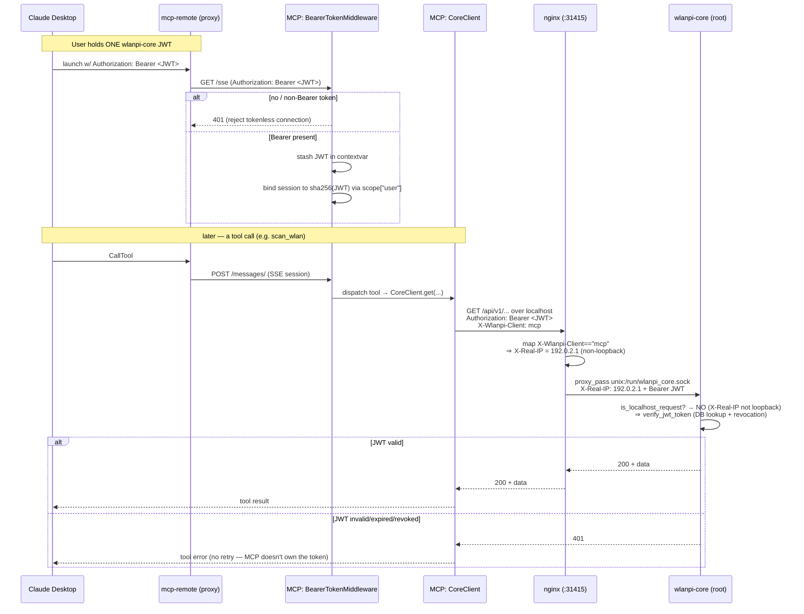
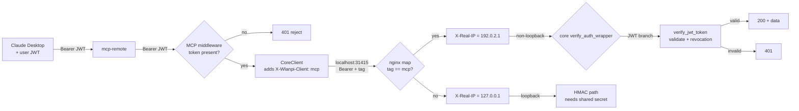

# Authentication flow: Claude → MCP → nginx → wlanpi-core

wlanpi-mcp implements **no authentication of its own**. The user holds a single
wlanpi-core JWT, and that same token is forwarded on every outbound wlanpi-core API call,
where core validates it. This document traces the token end to end, including the nginx
`X-Real-IP` override that lets on-box (loopback) calls reach core's JWT validator instead
of its localhost HMAC path.

## Sequence

## Where each auth decision happens

## The key handoffs, in words

| Hop | Carries | Auth decision |
|---|---|---|
| Claude Desktop → mcp-remote | `Authorization: Bearer <JWT>` | none — just transport |
| mcp-remote → MCP middleware | same Bearer on the `/sse` connection | **MCP:** reject if no Bearer (401); else stash JWT in contextvar |
| MCP CoreClient → nginx | `Bearer <JWT>` + **`X-Wlanpi-Client: mcp`** | none yet — MCP never validates |
| nginx → core (unix socket) | rewrites **`X-Real-IP` → `192.0.2.1`** because of the tag | **nginx:** selects which origin core sees |
| core `verify_auth_wrapper` | sees non-loopback X-Real-IP + Bearer | **core:** takes JWT branch → validates token, checks revocation |

The single source of truth for "is this caller allowed" stays in core's `verify_jwt_token`
— MCP and nginx only route; neither mints nor validates tokens. The one JWT the user holds
is the same credential end to end.

## Why the nginx X-Real-IP override is safe

Core decides HMAC-vs-JWT purely from `X-Real-IP` (`is_localhost_request` reads it first),
and core's own nginx sets that header. Today loopback callers get `X-Real-IP: 127.0.0.1`
and are forced onto the HMAC path, which needs the root-owned shared secret that the
unprivileged `wlanpi` user (which runs MCP) cannot read.

The `X-Wlanpi-Client: mcp` tag makes nginx present a non-loopback sentinel
(`192.0.2.1`, RFC 5737 TEST-NET-1) so core takes the JWT branch. This only lets a caller
opt *into* the stricter, JWT-required scheme — the token is still validated (signature,
expiry, revocation) by core. A caller that sends the tag without a valid JWT gets 401, so
the tag can never bypass authentication, only demand more of the caller.

## Session binding: one token per SSE session

SSE splits a session across two request types: the long-lived `GET /sse` connection (which
carries the token and in whose task tree tools actually execute) and short `POST /messages/`
requests that deliver each JSON-RPC call by `session_id`. Without extra care, a caller who
learns another user's `session_id` could POST tool calls into that user's authenticated
session — the calls would run with the victim's token.

To prevent this, `BearerTokenMiddleware` publishes a principal on `scope["user"]` keyed by
`sha256(token)`. The MCP SSE transport records that principal as the session owner at
connect time and rejects any later `POST /messages/` whose principal differs, responding
with the same `404` as a nonexistent session (`mcp/server/sse.py`). Effect:

- A message must carry the **same token** that opened the session, or it is refused.
- The token is not parsed or validated here (that stays wlanpi-core's job); the fingerprint
  only needs to be stable and unique per token, so a raw SHA-256 suffices and keeps the
  token itself off the principal object.

This closes blind cross-session injection on a trusted network. It does **not** by itself
defend against an attacker who can read the plaintext token off the wire — transport
encryption (TLS, or fronting MCP behind core's nginx) is the separate control for that.

## Stdio mode

There are no HTTP headers in stdio transport, so the middleware/contextvar path does not
apply. `WLANPI_CORE_TOKEN` from config/env is the fallback token source, and CoreClient
still adds the `X-Wlanpi-Client: mcp` tag on outbound calls.
